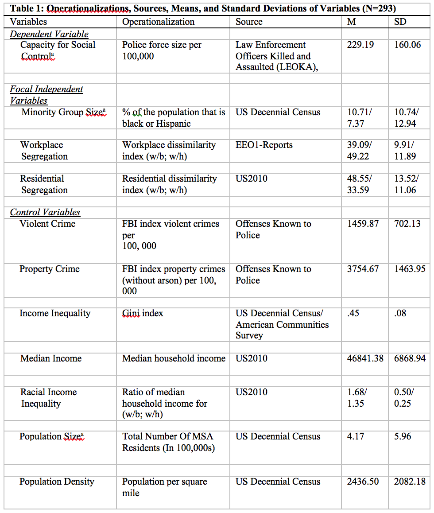
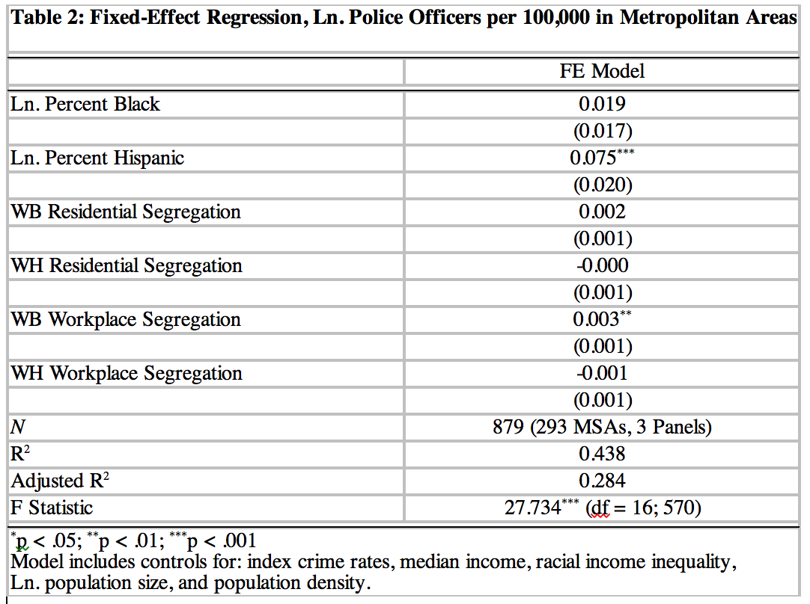

---
title: We Can Work It Out
subtitle: The Unintended Consequences of Workplace Integration for Urban Crime Control
author: Chris E. Rees
job1: Sociology, SUNY-Albany
job2: Center for Human Services Research, SUNY-Albany 
logo: University_at_Albany,_SUNY_Seal.svg.png
biglogo: University_at_Albany,_SUNY_Seal.svg.png
framework : io2012
highlighter : highlight.js
knit : slidify::knit2slides
widgets: [mathjax, bootstrap, quiz]
#github: {user: cerees, repo: referral_procedures_slides}
hitheme: tomorrow
assets: {js: 'test.js'}

---&footer

<!-- Limit image width and height -->

<!-- Center image on slide -->

## WHY studying workplace segregation matters?

>- Work is both an activitiy and an ecological setting
>- This setting can have a wide range of non-pecuniary effects 
>- Workplace experiences are shaped by segregation patterns 
>- These patterns vary geographically
>- How might these patterns shape the urban context in which they are derived?

---&footer

## WHAT is missing from the literature on urban crime control?

>- Focus on minority population size
>- Limited testing of segregation's impact on social control outcomes
>- Focus has been exclusively on residential patterns of racial contact
>- Mixed findings in this respect

---{
tpl: thankyou}

## Theory and Literature

---&footer

## HOW can we explain the relationship between workplace segregation and urban crime control?

>- Racial threat theory
  + Economic threat
  + Political threat
  + Integration may serve to exacerbate these feelings

---&footer

## HOW can we explain the relationship between workplace segregation and urban crime control?

>- Contact hypothesis
>- Increased contact ameliorates out-group stereotypes
    + Reducing inequality
    + Creating meaningful communication
>- Workplace may matter more
    + More likely to meet on the same terms
    + Contact moves beyond the superficial and creates social investment
    + Buoyed by institutionalized supports

---{
tpl: thankyou}

## Data and Methods

---&footer

## HOW did I analyze the data?

>- Metropolitan areas
  + Lived in space
  + Patterns of residential and worplace segregation
>- Dissimiliarity scores
  + Measure evenness
>- Fixed-Effects Model
  + Controls for all fixed-variables (e.g. Region)
  + Reduces variable omission bias
  + Hausman/Breusch–Pagan 

---&footer

## HOW did I analyze the data?

---{
tpl: thankyou}

## Results

---&footer

## WHAT I found?

---&footer

## WHAT I found?

>- Significant, but small effects for white-black workplace segregation
>- No significant effects for white-hispanic workplace segregation
>- Measures of black population concentraion and residenital segregation fail to gain significance

---{
tpl: thankyou}

## Future Directions and Conclusions

---&footer

## WHAT comes next?

>- Extending research examining the effects of workplace segregation 
>- Incorporating population change and interaction effects
>- Examining the effects of ethnoracial interaction in other domains
  + Theorizing and testing their different impacts

---{
tpl: thankyou,
social: [{title: chris, href: "cerees@albany.edu"}, {title: web, href: "http://www.albany.edu/chsr/"}, {title: slides, href: "http://cerees.github.io/everify_diffusion_slides"}]
}

## Thank You!

